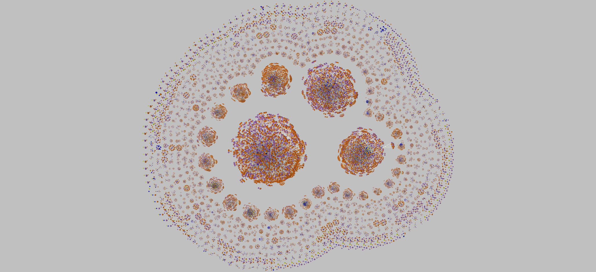
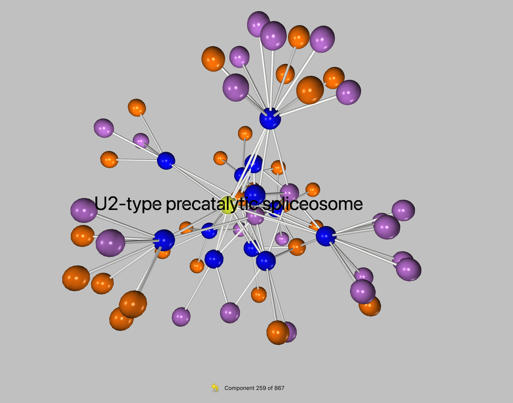
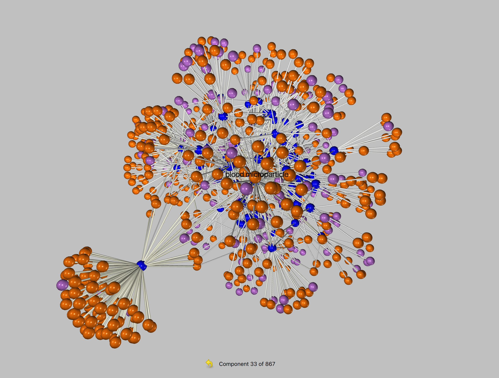
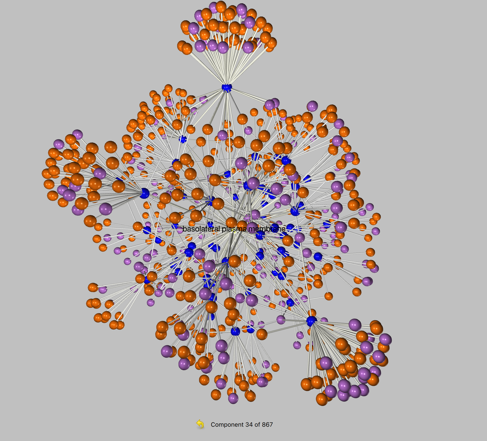
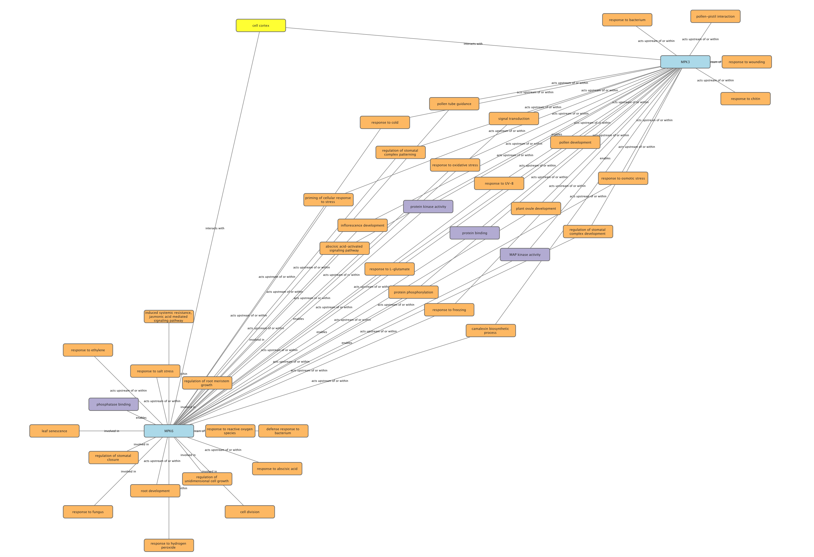

# Gene Graph

## What is this?

I'm currently learning about biology. High level explainations on genes all felt really hand-wavy to me. In the Twelfth Edition
of Campbell Biology, whenever genes were brought up, even in the chapters dedicated to the topic, my impression on the complexity of genetics as presented to me felt like something along the lines of "Here are some genes that do stuff". 

Later on they show a chart (page 448) showing how *Homo sapiens* has 21,300 protein coding genes. 21,300 unique things serving specific purposes seems like **a lot** to just gloss over in my opinion.

Then alternative splicing is brought up.
From the textbook:
> A typical human gene contains about ten exons, and an estimated 90% or more of these multi-exon genes are spliced in at least two different ways. Some genes are expressed in hundreds of alternatively spliced forms, others in just two. Scientists have not yet catalogued all of the different forms, but it is clear that the number of different proteins encoded in the human genome far exceeds the proposed number of genes.

This unfathomly large number of potential varients had me curious: how does this all come together to allow us to live?

I wanted to see what this looks like. 

NCBI has a tresure trove of information on individual genes. On inspecting what data they provided, I saw there is information detailing where in the cell the gene was found to be expressed, what function the gene performs, and what cellular process the gene is involved in for many different genes.

I asked myself: *For each unique cellular component, what gene was found to be expressed there, what does that gene do, and what purpose does it serve?*

This tool takes the above question and visualizes it into a graph. Cellular components are the root of the graph, genes form edges with that component if NCBI says it exists there, then functions and purposes form edges with that gene. 

This is generalized. It does not take into account specific tissues or any other nuances. I just wanted to see what is known.

## How to use this

*(Only tested on macOS 22F82, with Python3.10 via Homebrew.)*

Python3 is used.
Two environment variables are required.

`NCBI_API_KEY` should contain your API acquired from NCBI. See: https://ncbiinsights.ncbi.nlm.nih.gov/2017/11/02/new-api-keys-for-the-e-utilities/

`NCBI_EMAIL_ADDRESS` should contain your email address. NCBI asks this so they can contact you should a problem arise.

Make the script executable
```
chmod +x ./gene_graph.py
```

Usage:
```
./gene_graph.py --tsv_gene_list_file /path/to/gene_list.tsv
```

There are two optional command line arguments: 
    
* `--redownload` to redownload from NCBI and update the entry in the database

* `--separate_graphs` to save individual .gml files for each cellular component. By default, it's all saved to one .gml file.

## What does the script do?

The script takes in a tsv file downloaded from NCBI for a specific organism, then queries NCBI through the Entrez library for information on the gene and saves the response in database for later look up. 

*The response is compressed before saving and decompressed on access to reduce the size of the database. Some responses can be several megabytes of text.*

It then constructs a .gml file of nodes and edges which can be loaded into a program that can render this data. For my purposes, I use [Graphia](https://github.com/graphia-app/graphia). For smaller gml files, [Cytoscape](https://cytoscape.org/) is a nice tool. 

I also provided a full gml file and .graphia file for *Homo sapiens* if you just want to see what the data looks like without having to download a bunch of stuff from NCBI. 

These are the files `pregenerated_homo_sapiens_component_graph.gml` and `pregenerated_homo_sapiens_component_graph.graphia`.

Overall execution time from start to finish takes quite a while to complete. There are some optimizations I can make but the bulk of the time is just downloading from NCBI.

You can find tsv files from NCBI by looking at the list of genes for a specific organism. For example: To download a tsv file for *Homo sapiens*, go here, https://www.ncbi.nlm.nih.gov/datasets/gene/taxon/9606/, check the box to the left of "Gene ID", and hit the download button. 

## What does this produce?

Here's what you'll expect to see if you use Graphia.



Every cluster are genes found within a specific cellular component. 
* Blue nodes are genes.
* Orange nodes are cellular processes.
* Purple nodes are biochemical functions
* Yellow nodes are cellular components.


Honing in on a small cluster:


Larger cluster:

Blood microparticle


Basolateral plasma membrane


Viewing a component, cell cortex, from *Arabidopsis thaliana* in Cytoscape: 

I made this for fun, though I think there is potential here for research if I expand on it and take in concepts that I do not yet know exist in this domain. 

Some things that may be neat to visualize:

* Incorporate other sources of information
* Filter on coding and non-coding genes
* Filter on transcription factors, enzymes, structural/non-catalytic proteins, specific protein domains within a single gene
* Show what tissues in a specific cellular component a specific gene is found to be expressed in instead of this generalized approach of all genes in a single component
* Show possible relationships with protein domains and their cellular process or function
* Show miRNA interactions with protein coding genes (https://mirtarbase.cuhk.edu.cn/~miRTarBase/miRTarBase_2022/php/index.php)
* Expand the usefulness of the database
* Utilize the "interactions" data that NCBI provides